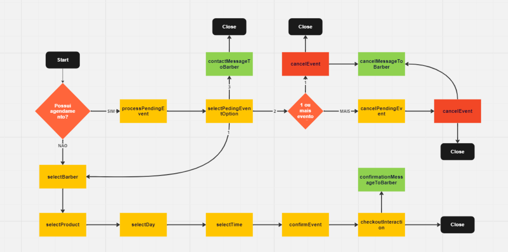

# Considerações

## Mensagens ignoradas pelo Bot

Algumas mensagens são ignoradas e não passam pelo processamento de interações.

- **mídia**: qualquer mensagem que seja arquivo, imagem, vídeo, gif e etc, será ignorada
- **status**: qualquer interação originada de status, será ignorada

## Acessar qrcode

Existe uma rota pré-configurada para exibição do qrcode no frontend, acessada através do endpoit `/qrcode`.

O mesmo também será exibido no console.

## Nomeclatura dos passos

A nomeclatura é composta por um verbo (ação a ser realizada) e o sujeito (objeto a ser modificado/selecionado), seguindo o padrão `camelCase`.

- **Ex**: Para realizar a _seleção_ de um _produto_ eu uso a seguinte sintaxe para a nomeação do meu passo:

  > selectProduct()

- O método de cada passo precisa ter o mesmo nome que o valor passado no método `updateCurrentStep()` como parâmetro.

## Estrutura para de construção de passo

0 - Verifica se a resposta enviada pelo cliente corresponde a uma das opções disponíveis (Com excessão do passo 0)

- **Se não**: acessa a propriedade `lastMessageSent` da instância atual, atualiza o contador de erros, e reenvia a última mensagem

1 - Monta primeira parte da mensagem na variável `answer`

2 - Captura o array de opções do passo atual

3 - Adiciona as opções do passo atual partir de um `forEach`

4 - Atualiza a interação para o próximo passo através do método `updateCurrentStep()` da instância atual

5 - Retorna um objeto com as propriedades `answer` e `chatId`

- **answer**: string com resposta a ser enviada
- **chatId**: destino da mensagem

## Fluxograma

Abaixo temos o [fluxograma](https://miro.com/welcomeonboard/WHJRakVERDBFT3F5cnZBdndDa2pSd0VnSzBwNGFXRzBZU05LZTc1VFRkb1N0VkViS09keHJ5S29wUk1LWktkSnwzNDU4NzY0NTQ5Njg2NzY2ODk4fDI=?share_link_id=346246975191) atual do projeto.

> O fluxograma precisa ser atualizado sempre que o fluxo de passos for alterado.

# Próximos passos

- [x] Finalizar construção de passos principais

- [x] Permitir o agendamento de mais horários para um mesmo contato

- [x] Excluir sessão por excesso de respostas inválidas

- [ ] Adicionar botão de voltar ao menu principal

- [x] Permitir o cancelamento de evento específico

- [x] Encerramento de sessão e exclusão de objeto criados

- [x] Adicionar exclusão diária de interações

- [ ] Implementar agenda de final de ano, permitindo a escolha de um intervalo de tempo a ser selecionado

- [x] Documentação de fluxograma de passos
